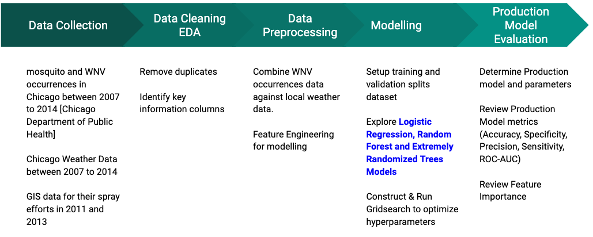
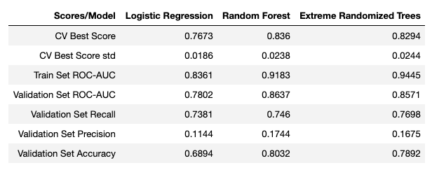
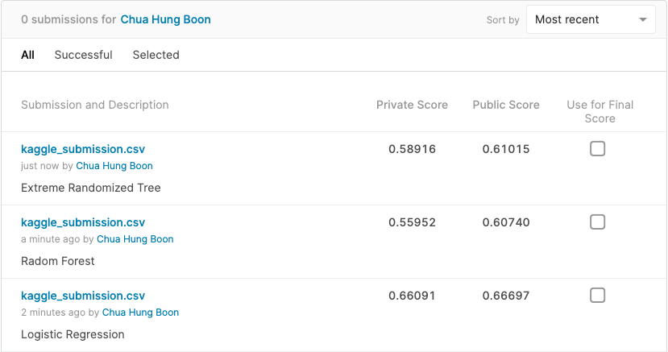

# Project 4 : Predicting the West Nile Virus Prediction in Chicago

## Content

- [Problem Statement and Context](#Problem-Statement-and-Context)
- [EDA, Cleaning and Preprocessing](#EDA,-Cleaning-and-Preprocessing)
- [Modelling](#Modelling)
- [Consequences of Model Error](#Consequences-of-Model-Error)
- [Cost-Benefit Analysis](#Cost-Benefit-Analysis)
- [Recommendations](#Recommendations)
- [Conclusion](#Conclusion)
- [Next Steps](#Next-Steps)

---

## Problem Statement and Context

Given the datas, we would like to create a model which predicts whether or not West Nile Virus is present, for a given time, location, and species and other information from the data we are presented.

Classification models considered were Logistic Regression, Random Forest and Extremely Randomized Trees.

Our success criteria will be based on Receiver Operating Characteristic (ROC) Area Under Curve (AUC) score minimally of 0.7 or even higher.

The main aim of this project seek to accurately predict WNV outbreaks and help the City of Chicago to efficiently allocate resources towards preventing transmission of WNV.

## Methodology and Project Planning

https://docs.google.com/spreadsheets/d/19sgeRZRZYYuiMuROpuCWIx80JnNI33MjSzJgZ3xvzBs/edit#gid=1999430656

---

## EDA, Cleaning and Preprocessing

### Training and Test Set of the Main Dataset

No null values in both train and test datasets.
All columns on address information were removed as only longitude and latitude is used for identifying locations.
All column names were converted to lowercase for easy reference.
Date column were reformated to day of week, month, and year.
Categorical variables converted to dummies (one-hot encoding) for feature processing.

The more mosquitos in the trap, the likely WNV is present.
WNV is only transmitted by Culex Pipiens and Culex Restuans.
In July 2007, the number of mosquitoes and WNV peaked during its first discovery.
In Aug 2007, WNV can be found throughout Chicago and the occurrence of WNV began to subside thereafter.

### GIS data of spraying efforts in 2011 and 2013
- Cleaning
    - Remove duplicates
    - Changing 'Date' data type from object to datetime.
    - remove spray location outside trap locations longitude/latitude
- EDA
    - Spray efforts efficacies inconclusive
    - Some locations saw notable drop in in mosquitos trapped and WNV incident
    - Some locations did not see any benefits
    
### Weather Data from 2007 to 2014
- Cleaning
    - Changing 'Date' data type from object to datetime.
    - Added columns by breaking down date into 'Year','Month','Week','Day'
    - Fill missing values for PrecipTotal, WetBulb temperature, and average temperature
    - Remove non-temperature and non-humidity columns (emphasize these two variables)
- Feature Engineering
    - Daily temperature range (Max daily temp - min daily temp)
    - Relative humidity (from Wetbulb temp and Tavg)
    - 7 day rolling average temperature
---

## Modelling

### Baseline
- We are dealing with a very unbalanced dataset
- With only 5% 'positive' class, Accuracy will not be meaningful for model evaluation
- Objective is to FIRST create a model that can generalize well followed by best ROC-AUC and Recall scores

### Consequences of Model Error
- It's more important to predict as many TRUE WNV incidents as possible since there are more grave health and medical cost concerns
- Therefore Type 2 errors (real wnv cases wrongly classified as non case) is a more serious error to avoid
- We need have more considerations for Sensitivity (recall) scores.

### Evaluation
- We want to create a production model that can provide useful feature importance information
- Logistic Regression, Random Forest, Extremely Randomized Trees were considered

- Extreme Randomized Trees and Random Forest models have higher spread among it's cross validation tests scores.
- Logistic Regression has lowest spread among it's cross validation test scores
- Extreme Randomized Trees has highest difference between Train and Validation set scores
- Logistic Regression and Random Forest have similar Train-Validation test scores difference
- Although Logistic Regression do not have the best scores, it is more likely to generalize unseen data

### Feature Importance
WNV occurrences is highly related to 
- month of the year. Likely due to higher temperature, rainfall between Aug and Oct
- Wetbulb, precip 7D ave: Humidity related
- Mosquito Species present
- trap ids, probably location related (e.g. locations with many stagnant water traps)

### Kaggle Submission

---

## Cost-Benefit Analysis
- Sacremento county 2005 as case study
  - 3 main categories: Asymptomatic (82.6%), West Nile Fever(12.5%), and West Nile Neuroinvasive Disease(4.9%)
  - Cost per patient is $1035 for WNF, $57070 for WNND
  - Aerial spray response to the WNV epidemic cost $701,790
  - Economic breakeven if >=15 WNND patients are prevented with spray
  - Carney et al. documented 18 (13 WNF, 5 WNND) total WNV disease cases outside the spray area after the Sacramento County emergency spray and no cases within the spray area
  - 1km2 of spraying → ~$1467USD
  - 39km2 → ~$57000 (cost of one WNND patient)

Sources:
- https://www.ncbi.nlm.nih.gov/pmc/articles/PMC3322011/
- https://www.chicago.gov/content/dam/city/depts/cdph/statistics_and_reports/CDInfo_2013_JULY_WNV.pdf
- https://www.mdpi.com/1999-4915/12/4/458

---

## Recommendations
- Two prong approach:
  - Preventive: Larvicide treatments (per model prediction),
  - Reactive: Adulticide treatments (ie. Sacramento)

---

## Next Steps
- Consider modeling using geographical proximity to weather station for imputation of variable values
- Apply other machine learning models to train the data
- If possible, gather more data to ascertain missing values

---
